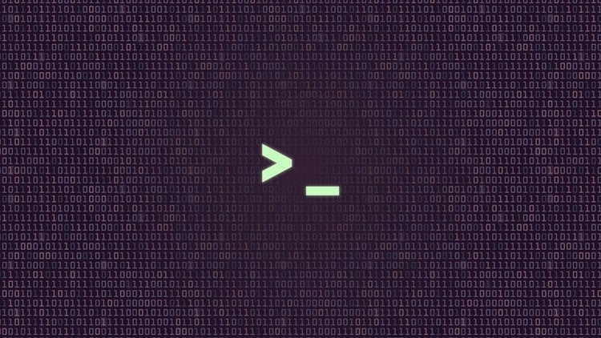

<div align="center">
  <a href="https://github.com/alexdrumi/webserv">
    
  </a>
</div>

# MINISHELL
> **Minishell** is a compact yet powerful command-line interface inspired by Bash. It provides a hands-on way to explore how shells really work. It covers everything from parsing user input to process management, environment variables, and signal handling.

<br>

## Table of Contents
* [General Info](#general-information)
* [Features](#features)
* [Usage](#usage)

## General Information
Minishell displays a command prompt indicating that the user can enter a command. Once you type a command and press Enter, Minishell interprets it, launches a new process, and executes the appropriate program—either a built-in command or a system utility.

Minishell also supports:
- Setting and managing environment variables.
- Executing scripts.
- Handling processes and related signals (like `Ctrl-C`, `Ctrl-D`, and `Ctrl-\`).

This project is part of a learning experience aimed at reproducing key features of Bash, offering an in-depth look at how shells interact with Unix-like systems under the hood.

## Features
- **Redirection & Here-Doc**: Input, output, and append redirection, plus here-doc support.
- **Environment variables**: Manage both local and environment variables seamlessly.
- **Signal Handling**: Correctly responds to `Ctrl-C`, `Ctrl-D`, and `Ctrl-\`.
- **Quoting**: Properly handles single and double quotes for more complex command strings.
- **History**: Keeps a working history of previously entered commands.
- **Built-ins**: Implements `cd`, `echo`, `pwd`, `export`, `unset`, `env`, and `exit`.
- **Exit Status Variable**: `$?` is available to show the exit status of the last command.

## Usage


5. **Download the repository:**
   ```bash
   git clone git@github.com:alexdrumi/minishell.git
   cd minishell
  
6. **Compile and run the executable:**
   ```bash
   make && ./minishell

